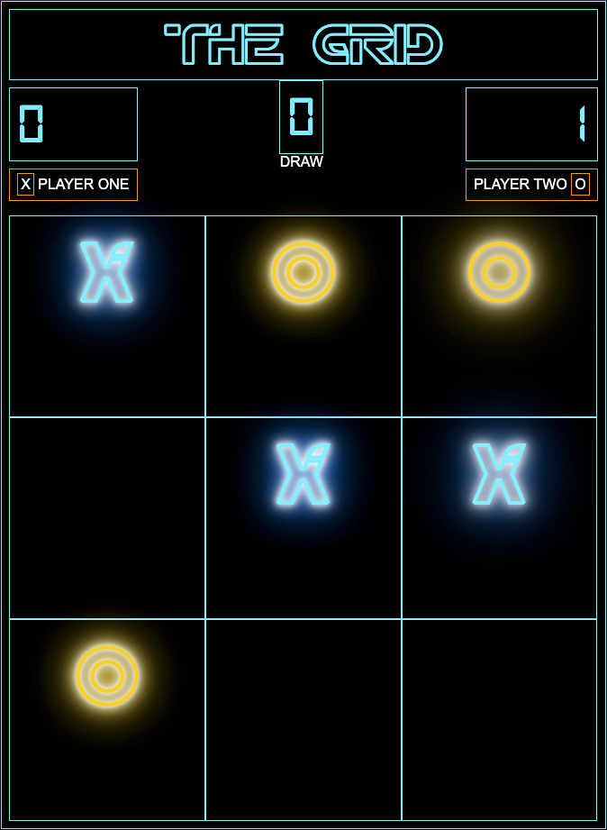

# ✨✨ - TIC-TAC-TRON - ✨✨
(GA Software Engineering Immersive - Project 1)

## 1. 🕹 [Play Here](https://oldermcdonald.github.io/Tic-Tac-Tron/) 🕹

## 2. 📜 Project Brief:
To build an interactive front-end app that functions as a 2-player tic tac toe game, styled with CSS and given a Tron theme. Built with HTML, CSS and Javascript.

## 3. 💻 Game Features:
- Live score board
- Adjustable board size (3x3 up to 6x6)
- Adjustable win condition (ie 3 or 4 in a row to win)
- Reset function
- Responsive design (flexbox)
- CSS animations
- shaweeet neon effects

## 4. 🏋️ Key Challenges: 
This was my first front-end project involving DOM manipulation and creation of elements with Javascript and I learned a bunch of new things including writing the algorithms to determine the winning conditions. As I wanted to create a board that could be increased in size the biggest challenge was coming up with the win condition for diagonal matches especially when not counting the entire row.

## 5. 🕒 Project Timing
Made in class over 2 days
