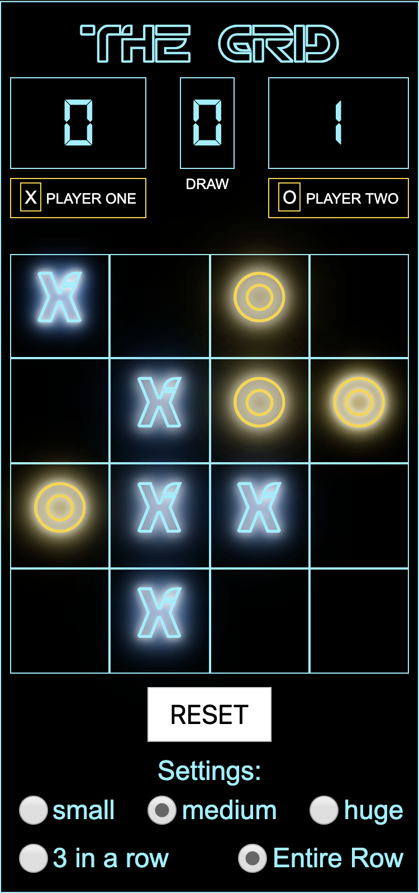

# ✨ TIC-TAC-TRON ✨
(GA Software Engineering Immersive - Project 1)

## 🕹 [Play Tic Tac Tron](https://oldermcdonald.github.io/Tic-Tac-Tron/) 🕹

## 📜 Brief
Build an interactive front-end app that functions as a 2-player tic tac toe game, styled with CSS. Built with HTML, CSS and Javascript.

## 💻 Features
- Live score board
- Adjustable board size
- Adjustable win condition
- Reset function
- Responsive design
- CSS animations
- shaweeet neon effects

## 🏋️ Key Challenges
This was my first front-end project involving DOM manipulation and creation of elements with Javascript and I learned a bunch of new things including writing the algorithms to determine the winning conditions. As I wanted to create a board that could be increased in size the biggest challenge was coming up with the win condition for diagonal matches especially when not counting the entire row.

## 🕒 Timing
Made in class over 2 days
